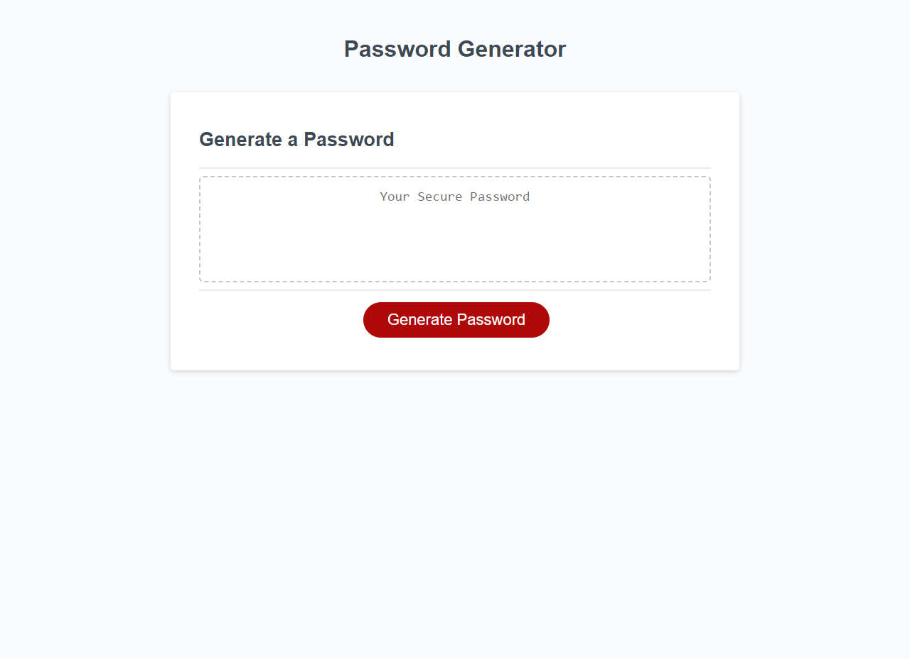

# Password Generator Starter Code

## Description
The goal of this password generator project is to create a secure password based on user-selected criteria. When the user clicks the generate button, they will be prompted with a series of criteria options such as password length and character types (lowercase, uppercase, numeric, and special characters). The user's inputs will be validated to ensure a valid password can be generated. Once all prompts are answered and validated, a password will be generated that matches the selected criteria. The generated password will then be displayed either in an alert or written to the page. This project aims to provide an intuitive and secure solution for generating strong passwords with customizable criteria.

## Screenshot

## Link to deployed application
https://zekedomz.github.io/random-pw-gen/